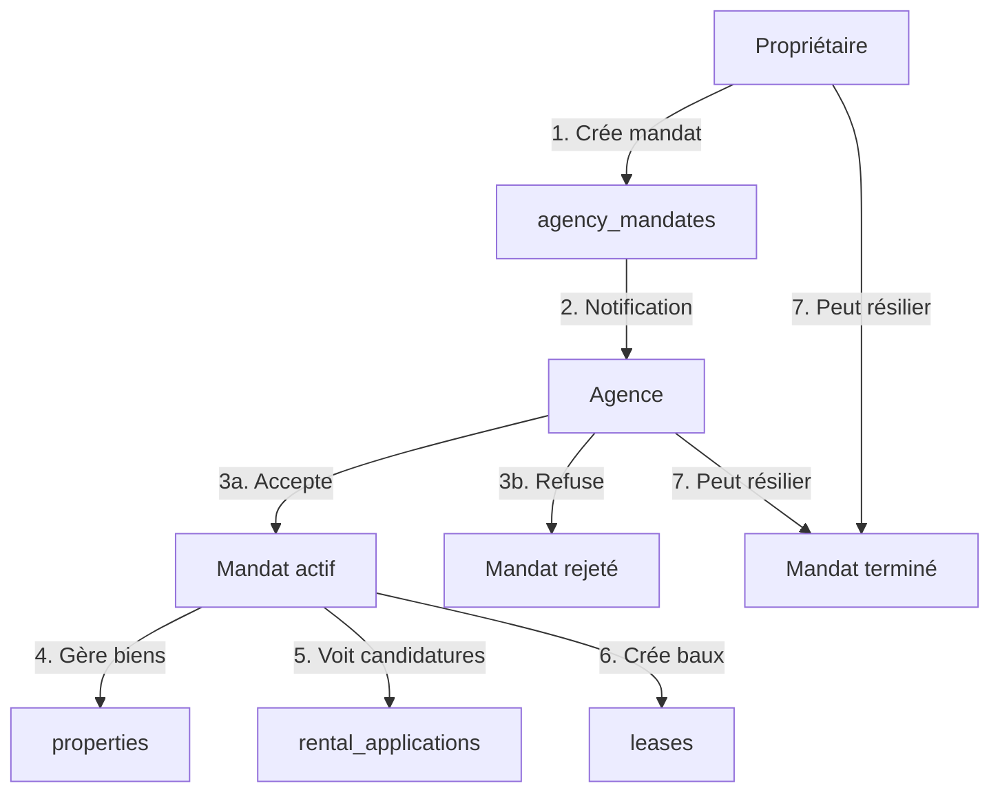
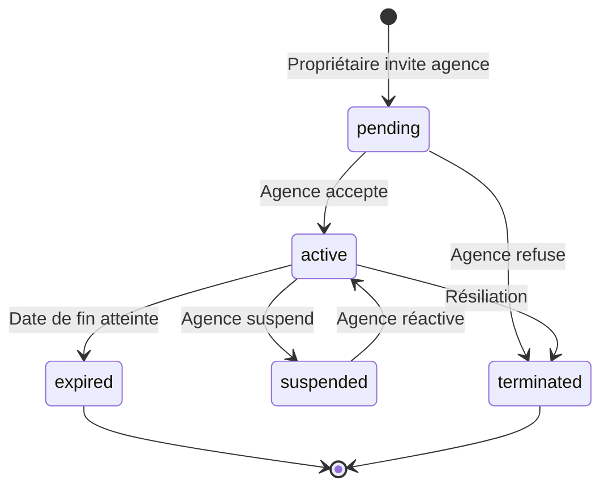

# Système de Mandats d'Agence

## Vue d'ensemble

Le système de mandats d'agence permet aux propriétaires de déléguer la gestion de leurs biens à des agences immobilières professionnelles. Ce système offre une gestion fine des permissions, une traçabilité complète et une sécurité renforcée via les Row Level Security (RLS) policies de Supabase.

## Architecture

### Schéma de base de données

#### Table `agency_mandates`

```sql
CREATE TABLE agency_mandates (
  id UUID PRIMARY KEY DEFAULT gen_random_uuid(),
  agency_id UUID NOT NULL,
  owner_id UUID NOT NULL,
  property_id UUID, -- NULL = mandat global
  mandate_type TEXT NOT NULL, -- 'location' | 'gestion_complete' | 'vente'
  status TEXT NOT NULL DEFAULT 'pending', -- 'pending' | 'active' | 'suspended' | 'terminated' | 'expired'
  commission_rate NUMERIC,
  fixed_fee NUMERIC,
  billing_frequency TEXT,
  permissions JSONB NOT NULL DEFAULT '{...}',
  start_date DATE NOT NULL,
  end_date DATE,
  accepted_at TIMESTAMP WITH TIME ZONE,
  terminated_at TIMESTAMP WITH TIME ZONE,
  terminated_by UUID,
  termination_reason TEXT,
  notes TEXT,
  created_at TIMESTAMP WITH TIME ZONE NOT NULL DEFAULT now(),
  updated_at TIMESTAMP WITH TIME ZONE NOT NULL DEFAULT now()
);
```

#### Structure des permissions (JSONB)

```typescript
interface AgencyMandatePermissions {
  can_view_properties: boolean;
  can_edit_properties: boolean;
  can_create_properties: boolean;
  can_delete_properties: boolean;
  can_view_applications: boolean;
  can_manage_applications: boolean;
  can_create_leases: boolean;
  can_view_financials: boolean;
  can_manage_maintenance: boolean;
  can_communicate_tenants: boolean;
  can_manage_documents: boolean;
}
```

### Flux de données



### Cycle de vie d'un mandat



## Hooks

### `useAgencyMandates`

Hook principal pour gérer les mandats d'agence.

**Emplacement** : `src/hooks/useAgencyMandates.ts`

**Utilisation** :

```typescript
import { useAgencyMandates } from '@/hooks/useAgencyMandates';

function MyComponent() {
  const {
    mandates,           // Tous les mandats de l'utilisateur
    activeMandates,     // Mandats actifs uniquement
    pendingMandates,    // Mandats en attente
    asAgency,          // Mandats où user est l'agence
    asOwner,           // Mandats où user est le propriétaire
    isLoading,         // État de chargement
    createMandate,     // Créer un nouveau mandat
    acceptMandate,     // Accepter un mandat (agence)
    refuseMandate,     // Refuser un mandat (agence)
    terminateMandate,  // Résilier un mandat
    suspendMandate,    // Suspendre un mandat (agence)
    updateMandatePermissions, // Modifier les permissions
  } = useAgencyMandates();

  return (
    <div>
      {mandates.map(mandate => (
        <div key={mandate.id}>{mandate.mandate_type}</div>
      ))}
    </div>
  );
}
```

**Mutations disponibles** :

1. **createMandate** :
```typescript
createMandate.mutate({
  agency_id: 'uuid',
  property_id: 'uuid' | null,
  mandate_type: 'location' | 'gestion_complete' | 'vente',
  commission_rate: 10,
  fixed_fee: 50000,
  billing_frequency: 'mensuel',
  permissions: { can_view_properties: true, ... },
  start_date: '2025-01-01',
  end_date: '2026-01-01',
  notes: 'Notes optionnelles',
});
```

2. **acceptMandate** :
```typescript
acceptMandate.mutate(mandateId);
```

3. **refuseMandate** :
```typescript
refuseMandate.mutate({
  mandateId: 'uuid',
  reason: 'Motif du refus',
});
```

4. **terminateMandate** :
```typescript
terminateMandate.mutate({
  mandateId: 'uuid',
  reason: 'Motif de résiliation',
});
```

5. **updateMandatePermissions** :
```typescript
updateMandatePermissions.mutate({
  mandateId: 'uuid',
  permissions: { can_edit_properties: true, ... },
});
```

### `useAgencyProperties`

Hook pour récupérer les propriétés gérées par une agence.

**Emplacement** : `src/hooks/useAgencyProperties.ts`

**Utilisation** :

```typescript
import { useAgencyProperties } from '@/hooks/useAgencyProperties';

function AgencyDashboard() {
  const { properties, isLoading } = useAgencyProperties();
  
  return (
    <div>
      {properties.map(property => (
        <PropertyCard key={property.id} property={property} />
      ))}
    </div>
  );
}
```

### `usePropertyPermissions`

Hook pour vérifier les permissions d'une agence sur une propriété.

**Emplacement** : `src/hooks/usePropertyPermissions.ts`

**Utilisation** :

```typescript
import { usePropertyPermissions } from '@/hooks/usePropertyPermissions';

function PropertyActions({ propertyId }) {
  const { canEdit, canDelete, canViewApplications } = usePropertyPermissions(propertyId);
  
  return (
    <div>
      {canEdit && <Button>Modifier</Button>}
      {canDelete && <Button>Supprimer</Button>}
      {canViewApplications && <Button>Voir candidatures</Button>}
    </div>
  );
}
```

## Composants

### Composants de mandats

#### `InviteAgencyDialog`
**Chemin** : `src/components/mandates/InviteAgencyDialog.tsx`

Formulaire pour inviter une agence avec validation complète.

**Props** :
```typescript
interface InviteAgencyDialogProps {
  open: boolean;
  onOpenChange: (open: boolean) => void;
}
```

**Fonctionnalités** :
- Recherche d'agence avec autocomplete
- Sélection du type de mandat
- Configuration des permissions granulaires
- Définition des termes financiers
- Détection de mandats en doublon
- Confirmation avant soumission

#### `MandateCard`
**Chemin** : `src/components/mandates/MandateCard.tsx`

Carte affichant les détails d'un mandat.

**Props** :
```typescript
interface MandateCardProps {
  mandate: AgencyMandate;
}
```

**Fonctionnalités** :
- Affichage du statut, type, dates
- Actions : Accepter, Refuser, Résilier
- Affichage des permissions avec icônes
- Tooltips contextuels

### Composants d'agence

#### `AgencyMandatesList`
**Chemin** : `src/components/agency/AgencyMandatesList.tsx`

Liste des mandats d'une agence.

**Props** :
```typescript
interface AgencyMandatesListProps {
  mandates: AgencyMandate[];
  isLoading: boolean;
}
```

#### `AgencyPropertiesView`
**Chemin** : `src/components/agency/AgencyPropertiesView.tsx`

Vue des propriétés gérées par une agence, groupées par propriétaire.

**Props** :
```typescript
interface AgencyPropertiesViewProps {
  properties: any[];
  mandates: AgencyMandate[];
}
```

**Optimisations** :
- Pagination si > 50 propriétés
- Lazy loading des images
- Groupement par propriétaire

#### `AgencyFinancialStats`
**Chemin** : `src/components/agency/AgencyFinancialStats.tsx`

Statistiques financières des mandats d'une agence.

**Props** :
```typescript
interface AgencyFinancialStatsProps {
  mandates: AgencyMandate[];
  properties: any[];
}
```

**Métriques** :
- Revenus estimés mensuels
- Commissions moyennes
- Frais fixes totaux
- Détail par mandat

## Sécurité

### Row Level Security (RLS) Policies

#### Propriétaires

1. **Création de mandats** :
```sql
CREATE POLICY "Propriétaires créent mandats"
ON agency_mandates FOR INSERT
WITH CHECK (auth.uid() = owner_id AND status = 'pending');
```

2. **Lecture de leurs mandats** :
```sql
CREATE POLICY "Propriétaires voient leurs mandats"
ON agency_mandates FOR SELECT
USING (auth.uid() = owner_id);
```

3. **Résiliation** :
```sql
CREATE POLICY "Propriétaires résilient mandats"
ON agency_mandates FOR UPDATE
USING (auth.uid() = owner_id);
```

#### Agences

1. **Lecture de leurs mandats** :
```sql
CREATE POLICY "Agences voient leurs mandats"
ON agency_mandates FOR SELECT
USING (auth.uid() = agency_id);
```

2. **Acceptation** :
```sql
CREATE POLICY "Agences acceptent mandats"
ON agency_mandates FOR UPDATE
USING (auth.uid() = agency_id AND status = 'pending');
```

3. **Refus** :
```sql
CREATE POLICY "Agences refusent mandats"
ON agency_mandates FOR UPDATE
USING (auth.uid() = agency_id AND status IN ('pending', 'active'));
```

4. **Suspension** :
```sql
CREATE POLICY "Agences suspendent mandats"
ON agency_mandates FOR UPDATE
USING (auth.uid() = agency_id AND status = 'active');
```

#### Admins

```sql
CREATE POLICY "Admins gèrent tous mandats"
ON agency_mandates FOR ALL
USING (has_role(auth.uid(), 'admin'));
```

### Triggers de notification

#### Notification à l'agence lors d'une invitation

```sql
CREATE OR REPLACE FUNCTION notify_agency_new_mandate()
RETURNS TRIGGER AS $$
BEGIN
  INSERT INTO notifications (user_id, type, title, message, link)
  VALUES (
    NEW.agency_id,
    'mandate_invited',
    'Nouveau mandat proposé',
    'Un propriétaire vous propose un mandat de gestion',
    '/mandates'
  );
  RETURN NEW;
END;
$$ LANGUAGE plpgsql;

CREATE TRIGGER on_mandate_created
AFTER INSERT ON agency_mandates
FOR EACH ROW
EXECUTE FUNCTION notify_agency_new_mandate();
```

#### Notification au propriétaire lors de l'acceptation

```sql
CREATE OR REPLACE FUNCTION notify_owner_mandate_accepted()
RETURNS TRIGGER AS $$
BEGIN
  IF NEW.status = 'active' AND OLD.status = 'pending' THEN
    INSERT INTO notifications (user_id, type, title, message, link)
    VALUES (
      NEW.owner_id,
      'mandate_accepted',
      'Mandat accepté',
      'L''agence a accepté votre mandat de gestion',
      '/mandates'
    );
  END IF;
  RETURN NEW;
END;
$$ LANGUAGE plpgsql;

CREATE TRIGGER on_mandate_accepted
AFTER UPDATE ON agency_mandates
FOR EACH ROW
EXECUTE FUNCTION notify_owner_mandate_accepted();
```

### Fonction de vérification des permissions

```sql
CREATE OR REPLACE FUNCTION can_access_property(property_id UUID)
RETURNS BOOLEAN AS $$
BEGIN
  -- Propriétaire du bien
  IF EXISTS (
    SELECT 1 FROM properties 
    WHERE id = property_id AND owner_id = auth.uid()
  ) THEN
    RETURN TRUE;
  END IF;
  
  -- Agence avec mandat actif
  IF EXISTS (
    SELECT 1 FROM agency_mandates am
    JOIN properties p ON (am.property_id = p.id OR am.property_id IS NULL)
    WHERE p.id = property_id
      AND am.agency_id = auth.uid()
      AND am.status = 'active'
      AND (am.permissions->>'can_view_properties')::boolean = true
  ) THEN
    RETURN TRUE;
  END IF;
  
  RETURN FALSE;
END;
$$ LANGUAGE plpgsql SECURITY DEFINER;
```

## Tests

### Scénarios de test manuels

#### Scénario 1 : Création et acceptation d'un mandat spécifique

1. Se connecter en tant que propriétaire
2. Aller sur "Mes Mandats"
3. Cliquer "Inviter une agence"
4. Sélectionner une agence, un bien spécifique, type "Location"
5. Configurer commission à 10%, facturation mensuelle
6. Activer permissions : voir, modifier, voir candidatures
7. Dates : 01/01/2025 → 31/12/2025
8. Valider → Vérifier notification créée
9. Se déconnecter
10. Se connecter en tant qu'agence
11. Voir notification → Aller sur "Mes Mandats"
12. Voir mandat "En attente"
13. Cliquer "Accepter" → Vérifier statut "Actif"
14. Vérifier que le bien apparaît dans "Biens gérés"

#### Scénario 2 : Mandat global

1. Se connecter en tant que propriétaire (avec plusieurs biens)
2. Créer un mandat SANS sélectionner de bien
3. Type "Gestion complète", toutes permissions activées
4. Vérifier que l'agence peut voir TOUS les biens du propriétaire

#### Scénario 3 : Résiliation d'un mandat

1. Avec un mandat actif
2. Propriétaire clique "Résilier"
3. Saisir motif : "Changement de stratégie"
4. Confirmer
5. Vérifier statut "Résilié"
6. Vérifier que l'agence n'a plus accès au bien

#### Scénario 4 : Détection de doublon

1. Créer un mandat actif pour Agence A + Bien 1
2. Tenter de créer un second mandat pour Agence A + Bien 1
3. Vérifier l'alerte "Un mandat similaire existe déjà"
4. Vérifier que le bouton de soumission est désactivé

### Cas limites à vérifier

- [ ] Mandat sans `end_date` → Affiche "Durée indéterminée"
- [ ] Suppression d'une agence → Mandats marqués comme invalides
- [ ] Suppression d'un bien sous mandat spécifique → Mandat reste mais sans bien
- [ ] Modification de permissions pendant que l'agence utilise le système
- [ ] Expiration automatique d'un mandat (date de fin dépassée)
- [ ] Tentative d'acceptation d'un mandat déjà accepté par une autre agence

## Optimisations

### Performance

1. **Memoization** :
```typescript
// Dans AgencyFinancialStats.tsx
const estimatedRevenue = useMemo(() => {
  return mandates.reduce((total, mandate) => {
    // Calculs complexes...
  }, 0);
}, [mandates, properties]);
```

2. **Pagination** :
```typescript
// Dans AgencyPropertiesView.tsx
const ITEMS_PER_PAGE = 50;
const [page, setPage] = useState(1);
const paginatedProperties = useMemo(
  () => properties.slice((page - 1) * ITEMS_PER_PAGE, page * ITEMS_PER_PAGE),
  [properties, page]
);
```

3. **Cache React Query** :
```typescript
// Dans InviteAgencyDialog.tsx
const { data: agencies } = useQuery({
  queryKey: ['agencies'],
  queryFn: fetchAgencies,
  staleTime: 5 * 60 * 1000, // 5 minutes
});
```

### Accessibilité

- Tous les boutons ont des `aria-label` explicites
- Navigation au clavier testée sur `InviteAgencyDialog`
- Contraste vérifié sur tous les badges (WCAG AA)
- Messages d'erreur accessibles aux lecteurs d'écran

## Roadmap

### Fonctionnalités futures

- [ ] Historique des modifications de permissions
- [ ] Signature électronique des mandats
- [ ] Export PDF du contrat de mandat
- [ ] Tableau de bord analytique pour les agences
- [ ] Multi-signature pour mandats complexes
- [ ] Intégration calendrier pour échéances de mandats
- [ ] Notifications par SMS pour événements critiques

### Améliorations techniques

- [ ] Tests unitaires (Vitest)
- [ ] Tests E2E (Playwright)
- [ ] Optimisation des requêtes SQL (index, vues matérialisées)
- [ ] Versioning des permissions (audit trail)
- [ ] Webhooks pour intégrations tierces
